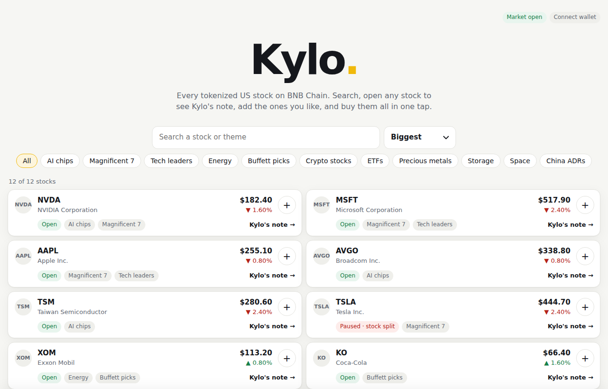
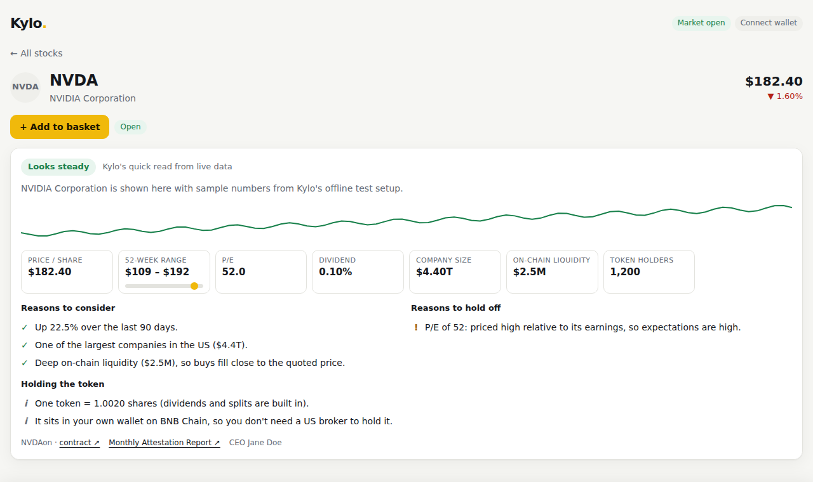
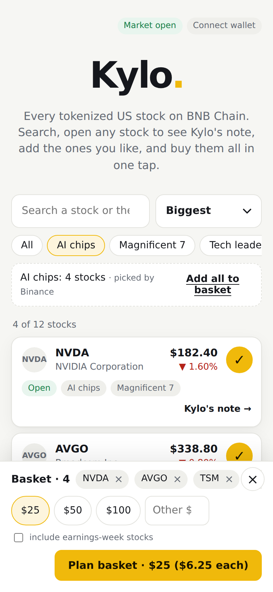
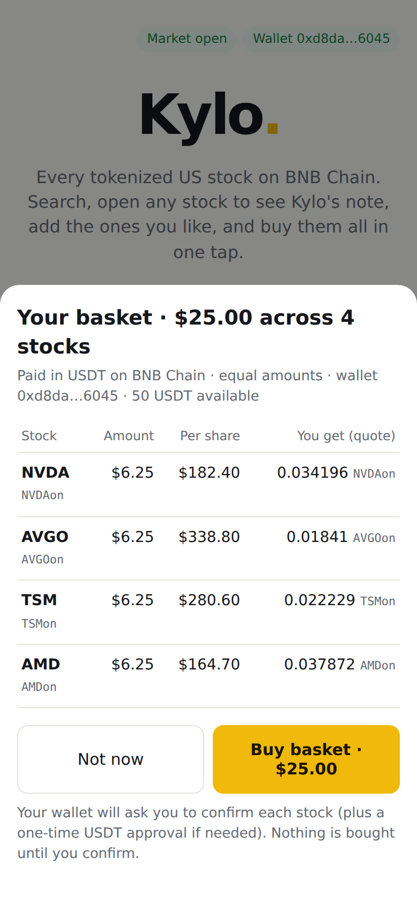
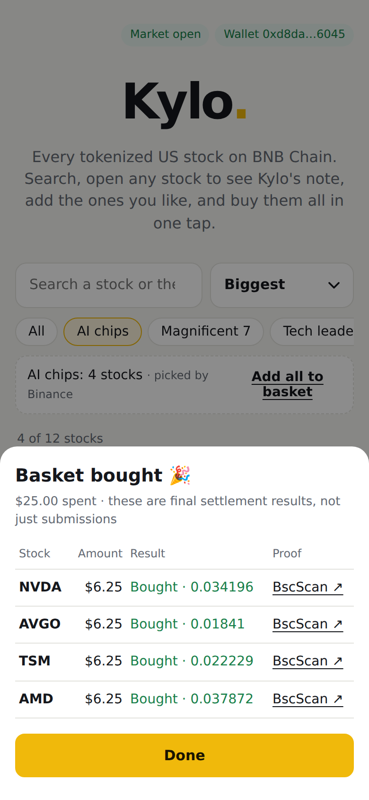

# Kylo.

**Buy a theme of real US stocks on BNB Chain in one tap, from your own wallet.**

Kylo lists every Ondo tokenized US stock and ETF on BNB Chain, explains each one in plain English, and turns a theme like *AI chips* or *Magnificent 7* into a basket you can buy with USDT in a few taps. Kylo never holds your money or your keys: every order is confirmed in your own wallet.

- **Live app:** https://kylo.myacxt.site
- **Built for:** [BNB Hack: Tokenized Stocks Edition](https://www.bnbchain.org/en/hackathons/tokenized-stocks) (main track, plus *Best Use of BNB Agent Studio*)
- **Built on:** the official [Binance Web3 API](https://web3.binance.com/en/dev-docs) (RWA Data, General Data, Trading, Transaction), Ondo tokenized stocks on BSC mainnet, and [BNB Agent Studio](https://www.bnbchain.org/en/bnb-agent-studio)

| Home | Kylo's note |
|---|---|
|  |  |

| Pick a theme | Plan the basket | Receipt |
|---|---|---|
|  |  |  |

<sub>Screenshots come from Kylo's offline test setup (a fake Binance Web3 API that checks request signatures), so the prices and company text are sample data. The live app shows real data.</sub>

---

## Contents

1. [Why Kylo](#why-kylo)
2. [What you can do](#what-you-can-do)
3. [How it works](#how-it-works)
4. [Binance Web3 API usage](#binance-web3-api-usage)
5. [How a basket is bought](#how-a-basket-is-bought)
6. [Kylo's note](#kylos-note)
7. [The Kylo agent (BNB Agent Studio)](#the-kylo-agent-bnb-agent-studio)
8. [Safety](#safety)
9. [Run it yourself](#run-it-yourself)
10. [Project layout](#project-layout)
11. [Known limits](#known-limits)
12. [Developer experience notes](#developer-experience-notes)

---

## Why Kylo

Tokenized stocks let anyone with a crypto wallet own a slice of Apple or Nvidia, around the clock, without a US broker. But today it feels like a trading terminal: hundreds of tickers ending in `on`, raw token prices, no idea which ones are paused for a stock split, and one swap per stock.

Most people don't think in tickers. They think "I want some AI chip makers" or "I want the big tech names". Kylo starts there:

- **Themes first.** Pick *AI chips*, *Energy* or *Buffett picks* and Kylo builds the basket.
- **Plain English.** Every stock has a short, rule-based note: what the company is, reasons to consider it, reasons to hold off, and what is different about holding the token.
- **One flow to buy.** One USDT approval for the whole basket, then one confirmation per stock, with live quotes before you commit.

## What you can do

1. **Browse every tokenized stock.** All Ondo stocks and ETFs on BSC (439 at the last live check), with live price, 24h change, trading status (`Open`, `Open · postmarket`, `Paused · stock split`, `Earnings`…) and logo. Search by company, ticker or theme. Sort by size, top gainers, top losers or A–Z.
2. **Pick a theme.** 11 themes: AI chips, Magnificent 7, Tech leaders, Energy, Buffett picks, Crypto stocks, ETFs, Precious metals, Storage, Space and China ADRs. The page says whether a theme's list came from Binance or from Kylo (see [Known limits](#known-limits)).
3. **Read Kylo's note.** Tap *Kylo's note →* on any stock to open its own page (shareable, e.g. `kylo.myacxt.site/#/stock/NVDA`) with a 90-day chart, key numbers and the note.
4. **Build a basket.** Add stocks one by one or a whole theme. Choose $25, $50, $100 or your own amount. Close the basket with × and reopen it from the yellow *Basket* button.
5. **Plan and buy.** *Plan basket* shows each stock, its amount, the live quote and your USDT balance. Stocks that can't be bought right now are left out with the reason. *Buy basket* walks your wallet through the approval and one confirmation per stock, then shows a receipt with BscScan links.
6. **Sell.** *My stocks* lists the stock tokens in your wallet with a rough USD value. *Sell* swaps a whole holding back to USDT through the same Binance Web3 API route, approved and signed in your wallet (Binance only routes orders over $5).

Works in any browser wallet that injects `window.ethereum` (MetaMask, Trust Wallet, Binance Wallet's browser extension…), on phone and desktop.

## How it works

```
 Browser (phone or desktop)                      user's own wallet (MetaMask, Trust…)
 client/web/index.html                           signs every approval and order
   │  browse · Kylo's note · plan · buy                  ▲
   ▼                                                     │ EIP-1193 (window.ethereum)
 Kylo web server  ── client/server.mjs ──────────────────┘
 Render free plan, Singapore region · holds ONLY the Web3 API key, never a wallet key
   │
   ├─ client/web3api.mjs   signed calls to the official Binance Web3 API (HMAC-SHA256),
   │                       throttled, retried on rate limits, logged to dx/calls.jsonl
   ├─ client/data.mjs      token list, themes, stock detail, rule-based Kylo's note
   ├─ client/trade.mjs     deterministic basket planner, quotes, order building,
   │                       approval simulation, order submit and status
   ├─ /api/logo            fetches stock logos from Binance's image host for the browser
   │
   └─ POST /api/take ───►  Kylo agent (app/agent, BNB Agent Studio)
                           ERC-8004 identity · A2A + x402 + ERC-8183 surface ·
                           writes the plain-English "written note" with its LLM
                           from facts the web server passes in
```

**Two parts, two jobs.**

- **The web app** (`client/`) is plain Node.js (no framework, no build step) and a single HTML page. It talks to Binance and to the user's wallet. It is where all the money logic lives, and that logic is fixed code with no LLM in it.
- **The agent** (`app/agent/`) is a BNB Agent Studio seller agent. It has its own on-chain identity and wallet, sells its work over x402 and ERC-8183, and writes the longer "written note". It never touches the user's funds.

## Binance Web3 API usage

Every call is signed with the documented scheme, `base64(HMAC-SHA256(secret, timestamp + METHOD + "/build" + path + query + body))`, and sent with the `X-OC-APIKEY`, `X-OC-TIMESTAMP`, `X-OC-SIGN` and `X-OC-RECV-WINDOW` headers. Test vectors in `client/test/client.test.mjs` match the official Python connector byte for byte.

| Module | Endpoint | Used for |
|---|---|---|
| RWA Data | `GET /api/v1/dex/market/rwa/tokens` | The full Ondo list on BSC, plus one call per sector tab for themes |
| RWA Data | `GET /api/v1/dex/market/rwa/underlying-profile` | Company description, CEO, industry, protections (attestations) |
| RWA Data | `GET /api/v1/dex/market/rwa/underlying-market` | Trading status, 52-week range, market cap, P/E, dividend yield |
| RWA Data | `GET /api/v1/dex/market/rwa/price` | Token and reference prices |
| General Data | `POST /api/v1/dex/market/price-info` | On-chain price, 24h change, liquidity and holders, batched 100 at a time |
| General Data | `GET /api/v1/dex/market/candles` | 90 daily candles for the chart and the 90-day trend rule |
| General Data | `GET /api/v1/dex/market/token/top-liquidity` | Liquidity fallback when price-info has none |
| Trading | `GET /api/v1/dex/aggregator/quote` | Live quote per stock (USDT → stock token), with the buyer's wallet for RFQ routes |
| Trading | `GET /api/v1/dex/aggregator/swap` | Builds the order: a swap transaction, or EIP-712 typed data for RFQ |
| Trading | `GET /api/v1/dex/aggregator/approve-transaction` | USDT approval calldata sized for the whole basket |
| Trading | `POST /api/v1/dex/aggregator/order/submit` | Submits a wallet-signed RFQ order |
| Trading | `GET /api/v1/dex/aggregator/order/{id}` | Polls RFQ orders until FILLED, FAILED or EXPIRED |
| Transaction | `POST /api/v1/dex/pre-transaction/simulate` | Dry-runs the USDT approval before the user is asked to sign it |

The modules are chained, not used side by side. RWA Data decides *what* can be bought (paused and earnings-limited stocks are filtered out). General Data explains *whether it is a good idea* (liquidity, holders, trend). Trading turns the plan into orders. Transaction simulates the one approval the user signs.

## How a basket is bought

The planner (`planBasket` in `client/trade.mjs`) is deterministic: the same inputs always give the same basket, and there is no LLM anywhere in the money path.

1. **Pick the stocks.** For a theme, take the theme's stocks and sort them by company size. For a hand-picked basket, use the stocks the user added (up to 20).
2. **Leave out what can't be bought.** Skip anything paused (stock split, corporate action), limited, under maintenance or unsupported, and say why. Earnings-week stocks are left out unless the user ticks *include earnings-week stocks*.
3. **Respect Binance's minimum.** The aggregator rejects orders under $5, and live testing showed it also rejects exactly $5.00, so every stock gets at least **$6**. A theme basket holds up to 5 stocks, fewer if the amount is small: $25 buys the 4 biggest at $6.25 each, and the plan says so.
4. **Split equally to the cent.** Amounts are converted to USDT's 18-decimal units with exact integer maths; the last stock absorbs the rounding so the legs add up exactly.
5. **Quote.** Each stock is quoted live, one at a time to stay inside the rate limit, and the user's USDT balance is read from BSC.
6. **Buy, one stock at a time:**
   - Get a fresh quote and build the order.
   - If the router's allowance is too low, build a USDT approval **for the rest of the basket**, simulate it with the Transaction API, and ask the wallet to send it once.
   - **Swap route:** the wallet sends the swap transaction, and Kylo waits for the receipt.
   - **RFQ route:** the wallet signs the EIP-712 order (`eth_signTypedData_v4`), Kylo submits it and polls until it is filled.
7. **Receipt** with each stock's status and a BscScan link.

Plans expire after 10 minutes, so stale quotes can't be bought.

## Kylo's note

Every stock page has a note built from live data by **visible rules** in `insightFor` (`client/data.mjs`). No black box:

- **Quick read:** *Looks steady*, *Mixed picture*, *Handle with care* or *Can't buy right now*, from a simple score.
- **Reasons to consider**, such as a strong 90-day trend, being one of the largest US companies, deep on-chain liquidity, or paying a dividend.
- **Reasons to hold off**, such as a high P/E, a big recent drop, thin on-chain liquidity, or trading near its 52-week high.
- **Holding the token**: how many shares one token is worth (Ondo builds dividends and splits into the ratio), that it sits in your own wallet, and warnings such as few holders or a closed market.
- **Numbers:** price per share, 52-week range, P/E, dividend, company size, on-chain liquidity and token holders, plus a 90-day chart.

When the Kylo agent is connected, an extra **"Ask Kylo for a written note"** button sends the same facts to the agent, which explains them in plain English. The agent is told to use only the data it is given, write numbers as digits, never claim the token is direct ownership of the company or carries voting rights, and never give price targets or buy/sell instructions.

## The Kylo agent (BNB Agent Studio)

`app/agent/` is a seller agent scaffolded with `bag init` (BNB Agent Studio CLI) and extended for Kylo.

- **Identity:** an ERC-8004 agent identity on BSC testnet, registered when the agent is deployed (`bag deploy verify --provider bnb`).
- **Runtime:** serves the standard Agent Studio surface: an A2A agent card plus JSON-RPC on port 9000, x402, and ERC-8183 job negotiation and delivery.
- **What it sells:**
  - `{"action":"insight","ticker":"NVDA","facts":{…}}` returns a written note: summary, reasons to consider, reasons to hold off, token notes and a one-line read.
  - `{"theme":"ai-chips","usd":50}` returns a deterministic basket plan (`src/stocks.ts`), with no LLM.
- **Earning:** the agent quotes a fixed USD price, signs it, and is paid in U through ERC-8183 escrow on BSC testnet. The written note the website shows is served free (`price_usd = "0"`), so visitors never pay for it.
- **Paid job, tested on BSC testnet (job 1414):** a test buyer paid 0.05 U into ERC-8183 escrow for an NVDA note ([fund tx](https://testnet.bscscan.com/tx/0xa48ba9d6b0b30d9aaf6c1894403f3db4fe9a2097e17c294a22bfb5dc519bac6e)), and the agent wrote the note and submitted it on-chain ([submit tx](https://testnet.bscscan.com/tx/0x790db8b4d44352189aa6575cce7b8e07506e2d4fd4fec8344d14e147b1898400)). After the 24-hour dispute window the job completed and the agent was paid; its wallet went from 20 U to 20.1 U across two paid jobs ([agent wallet on BscScan](https://testnet.bscscan.com/address/0xf218A2D8e22185339265961E3E7026b5557dB641#tokentxns)).
- **LLM:** the free Pieverse model through Agent Studio. Its replies can contain the model's reasoning before the JSON, so `extractNote` takes the last valid note object and never shows raw reasoning to users.
- **Signing stays in fixed code.** All on-chain signing lives in `src/signing.ts`, and none of it is exposed as an LLM tool. MCP tools are read-only. The wallet keystore lives at the workspace root in `.studio/wallets/`, outside anything that gets packaged or deployed.

## Safety

- **Kylo never holds your keys or funds.** The web server holds one secret, the Binance Web3 API key. It never asks for a seed phrase or private key.
- **You confirm everything.** Every approval and order is confirmed in your own wallet, and you can reject any of them. The approval is simulated first.
- **No LLM in the money path.** Which stocks, how much, and which token amounts are all fixed code. The LLM only writes explanations.
- **Paused stocks are blocked,** and earnings-week stocks need an explicit opt-in.
- **Narrow proxies.** `/api/logo` fetches only images, only from Binance's image hosts, and checks each file's real type before passing it on.
- **Not investment advice.** The notes describe live data with visible rules. Every decision is yours.

## Run it yourself

### Web app

Needs Node.js 22+ and a free Binance Web3 API key from https://web3.binance.com/en/dev-portal. The Web3 API is not available in every country; see Binance's [prohibited regions](https://web3.binance.com/en/dev-docs/web3-api-prohibited-regions).

```bash
git clone https://github.com/Mhiah/Kylo && cd Kylo
KYLO_W3_API_KEY=… KYLO_W3_API_SECRET=… node client/server.mjs
# open http://localhost:4402

node --test client/test/*.test.mjs   # unit tests (signing vectors, units, planner rules, notes)
```

| Variable | Default | Purpose |
|---|---|---|
| `KYLO_W3_API_KEY`, `KYLO_W3_API_SECRET` | none, required | Binance Web3 API credentials |
| `KYLO_AGENT_URL` | empty | The Kylo agent's base URL; enables the written note |
| `KYLO_BSC_RPC` | `https://bsc-dataseed.bnbchain.org` | BSC RPC for balances and allowances |
| `KYLO_W3_BASE` | `https://web3.binance.com/build` | API base (pointed at a mock in tests) |
| `PORT`, `HOST` | `4402`, `127.0.0.1` (or `0.0.0.0` on Render) | Where the server listens |

### Deploy the web app on Render (free)

`render.yaml` is a Render Blueprint: free plan, Singapore region, Node 22, health check `/healthz`. In Render choose **New → Blueprint**, pick this repo, and enter `KYLO_W3_API_KEY` and `KYLO_W3_API_SECRET` when asked. They are stored as Render secrets, never in the repo. Every push redeploys.

### The agent

Needs pnpm, Bun 1.3+ and the BNB Agent Studio CLI (`npm i -g @bnbagent/studio-cli`). See `AGENTS.md` and `app/agent/README.md` for the full rules.

```bash
pnpm install
pnpm --dir app/agent test              # agent unit tests
(cd app/agent && bag wallet new --generate-password)   # throwaway TESTNET wallet, kept in .studio/
bag llm activate                       # free LLM, no deposit
bag doctor                             # readiness checks
bag dev                                # run locally (A2A on :9000)
bag deploy --provider bnb              # BNB managed trial (testnet)
```

Then set `KYLO_AGENT_URL` on the web server to the agent's public URL.

## Project layout

```
client/
  server.mjs        HTTP server: JSON API, logo proxy, static page
  web3api.mjs       signed Binance Web3 API client (throttle, retry, DX log)
  data.mjs          token list, themes, stock detail, Kylo's note rules
  trade.mjs         basket planner, quotes, order building, approvals, submit
  web/index.html    the whole front end (vanilla JS, no build step)
  test/             node:test unit tests
app/agent/          BNB Agent Studio seller agent (TypeScript)
  src/unifiedMain.ts   entrypoint: insight and basket requests, A2A + x402 serving
  src/stocks.ts        deterministic basket planning for agent requests
  src/signing.ts       all on-chain signing (fixed code)
  studio.toml          agent config: wallet address, LLM, price, assets
docs/screenshots/   README images
dx/                 developer-experience notes and the API call log
render.yaml         Render Blueprint for the web app
AGENTS.md           rules for anyone (human or AI) editing this repo
```

## Known limits

Kylo is honest about where things stand:

- **Theme lists.** Binance's RWA sector tabs currently ignore the `tabId` filter and return every stock. When a tab comes back empty or unfiltered, Kylo falls back to its own short list for that theme and labels it *picked by Kylo*.
- **Attestation reports.** Binance lists Ondo's daily and monthly attestation PDFs, but its copies return HTTP 403 even from Singapore, and Ondo's own site is closed to many countries. Kylo states that the holdings are independently checked instead of showing dead links.
- **Order routes.** Live quotes for Ondo stocks currently come back as normal swaps through an aggregator route, which Kylo handles end to end. The RFQ (signed EIP-712 order) path is implemented and tested against the mock, but live Binance hasn't returned an RFQ route yet.
- **Minimum order.** Binance rejects orders of $5.00 or less, so Kylo needs at least $6 per stock.
- **Agent hosting.** BNB's managed agent trial is testnet-only and lasts 24–72 hours, so the agent is switched on around demo and judging time. The rest of the app works without it.

## Developer experience notes

Raw notes from building Kylo are in `dx/NOTES.md`, and every Web3 API call (endpoint, status, latency, never keys) is logged to `dx/calls.jsonl`. The written Developer Experience Report is submitted separately, as the hackathon requires.

---

<sub>Kylo is a hackathon project. Tokenized stocks are issued by Ondo and may not be available in every country. Nothing here is investment advice.</sub>
